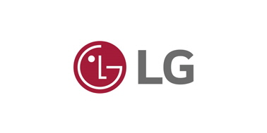
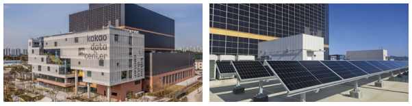
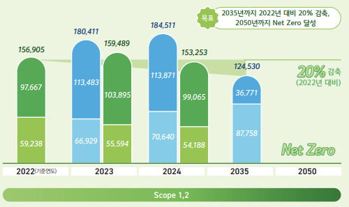

# 우리나라 기업의 ESG 경영과 신재생 에너지 투자 분석
-----
### **1. ESG 경영 이란?**

* 기업의 환경(Environment), 사회(Social), 지배구조(Governance)의 약자
* 친환경적으로 사회적 가치를 창출하며 투명한 경영을 통해 지속가능한 발전을 추구하는 것.
>기업들의 ESG경영 방식은 MZ세대의 가치소비로부터 시작되었다고 볼 수 있다. 
>
>친환경이나 비건 등 가치 중심 소비에 익숙한 이들은, 사회 문제에 적극적으로 나서는 기업을 찾아나서기도 함.
---
### **2. ESG 경영 사례**
1. 풀무원

* 2021년 기준 한국기업지배구조원의 평가에서 통합 A+ 등급에 올랐다.
* 환경관리시스템의 표준화, 온실가스 배출량 관리 등 환경 개선에 주의를 기울임 -> 환경 부분
    * 친환경포장 도입, 100%재활용 가능한 포장재 사용
* 10년 이상 '어린이 바른 먹거리 교육'을 이어옴 -> 사회 책임 부분
* 전문 경영인과 이사회 평가 정보를 공개함으로 투명성과 효율성 제고 -> 지배구조 부분
>사람과 자연을 함께 사랑하는 LOHAS 기업
----
2. 카카오

* 통합 A등급
* 자가 태양광 발전 등으로 안정적 공급 기반을 마련. 
    * 제주오피스 100% 전환을 시작으로 재생에너지 도입 확대
    * 일부 전력을 지역사회에 조달
* 내부탄소가격제도 : 기후리스크를 재무 의사결정에 통합하고, 저탄소 전환을 촉진하기 위한 수단
* 소상공인의 디지털 전환을 지원하기 위해 동방성장 프로그램 **'프로젝트 단골'**을 운영.
* '안녕하게 지낼 수 있는 디지털 세상' 톡안녕 보고소 발간
    * 서비스 내 잠재적인 위험과 실제 발생한 문제에 더해 카카오톡 서비스의 운영원칙에 따라 조사한 결과 공개
*이사회 산하에 ESG위원회를 설치
* 청년 일자리 창출을 위한 **'청년희망ON 프로젝트'**
>사람을 이해하는 기술로
필요한 미래를 더 가깝게 만듭니다.
----
3. LG

 * 탄소중립, 재생에너지 전환(2050년 100% 목표)
 * 생산사업장 폐기물 재활용률 95% 달성
 * 7대 주요제품 사용단계 원단위 탄소 배출량 20% 감축
 * DEI 주요지표로 2030년까지 장애인 임직원 비율 3.5%, 여성 임직원 비율 25.5% 목표
 * LG전자는 장애인, 노인, 아동, 임산부 등 특화매뉴얼을 적용중
 >모두의 더 나은 삶을 지향한다.

------

### **3. 신재생에너지 투자 전략**
----
* 기업의 신재생에너지 투자 전략은 직접 발전 시설을 구축, 에너지 효율화, 관련 산업 생태계 투자, 혁신 기술 개발 등 다양한 방식

1. SK 이노베이션 E&S
    * 태양광 발전 산업 : 총 3.2GW규모 태양광 발전 설비 운영 및 개발 중
    * 육상(염전, 염해)및 수상 중심으로 대규모 태양관 산업 추진
    * 풍력 발전 산업 : 신안, 평창, 양산에서 대규모 육상 풍력발전 운영
    * 전남 지역 우수한 입지를 활용하여 대규모 해상 풍력 단지 개발 중

![sk이노베이션]](image-8.png)

2. 카카오
    * RE100 가입 
    * 제주 오피스 전력의 100%를 태양광 에너지로 전환
    * 기후위기 대응 원칙 수립, 환경문제 해결을 위해 **'Active Green initiative'** 발표
        * 온실가스 배출제로를 목표로 하는 넷 제로 추진

    
3. 풀무원
    * 단기적 목표 : 태양광에너지 설비 구축
    * 중장기적 목표 : 전력구매계약(PPA)체결 및 수소에너지 도입 추진
    * 넷 제로 추진
        * 개선, 제조 공정의 에너지 효율화
        * 수배송 최적화
        >전 과정 단계별 탄소 배출 감축
        

